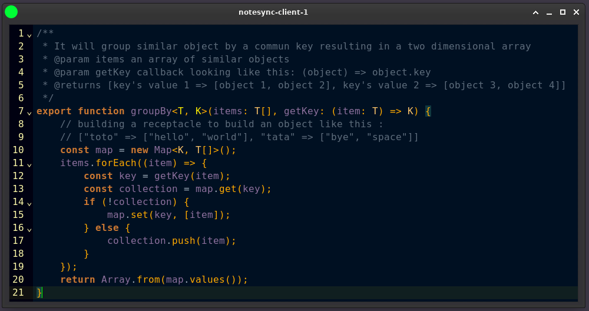

<pre>
    _   ______  ____________   _______  ___   __________  ______  ____  _   ___________   __________ 
   / | / / __ \/_  __/ ____/  / ___/\ \/ / | / / ____/ / / / __ \/ __ \/ | / /  _/__  /  / ____/ __ \
  /  |/ / / / / / / / __/     \__ \  \  /  |/ / /   / /_/ / /_/ / / / /  |/ // /   / /  / __/ / /_/ /
 / /|  / /_/ / / / / /___    ___/ /  / / /|  / /___/ __  / _, _/ /_/ / /|  // /   / /__/ /___/ _, _/ 
/_/ |_/\____/ /_/ /_____/   /____/  /_/_/ |_/\____/_/ /_/_/ |_|\____/_/ |_/___/  /____/_____/_/ |_|                            
</pre>

# what is it?

A simple code editor to shared note and mock across your team

Tauri is hosting is app, you can find its documentation [here](https://tauri.app/v1/guides/getting-started/setup)
You will need Rust on your computer, tauri documentation will help you set it up
[React](https://react.dev/) and [Codemirror](https://codemirror.net/) are the main libraries used for code editor display
To interact with websocket server, [Socket.io client](https://socket.io/) is used

# how to?

You will need a specific websocket server, you can find it [here](https://github.com/Armoredbrain/notesync-server)

# how does it look?

# how to customize?

in [here](./src/Editor.tsx), you can setup your own color theme like so:

